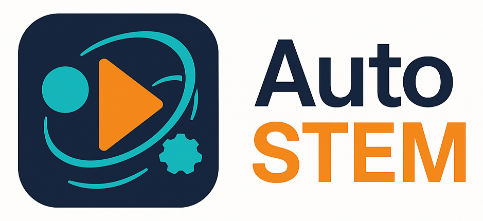

# B.R.I.D.G.E. | Boosting Robotics Interaction and Dynamic Guidance through Edutainment

  

## 🌍 AutoSTEM Project Context

This project has been developed within the **Erasmus+ AutoSTEM project**, an initiative aimed at supporting STEM education through innovative digital tools and interactive learning environments.

AutoSTEM focuses on enhancing computational thinking, robotics education, and control systems understanding through hands-on and simulation-based experiences.

---
## 🤝 Project Partners

  

---

---

## 🧩 Project Overview

B.R.I.D.G.E. (Boosting Robotics Interaction and Dynamic Guidance through Edutainment) is an educational serious game developed within the AutoSTEM project.

Within this context, B.R.I.D.G.E. is used as a **Virtual Toolkit** to support STEM education, with a specific focus on **control systems and computational thinking**.

The current version of the simulator focuses on the **BalaC robot** and its **PID control playground**, allowing users to experiment with control parameters and observe system behavior in real time through a visual block-based programming interface.

👉 B.R.I.D.G.E. represents the educational framework, while the distributed application is provided as **AUTOSTEM**.

---

## 📁 Folder Structure

- **docs/**  
  Contains project documentation, including User and Operator Manuals.

- **media/**  
  Images and assets used in the documentation and README.

- **src/**  
  Source files related to the BalaC PID playground component shared for educational and dissemination purposes.

- **NOTICE.md**  
  Attribution and project context.

- **LICENSE**  
  Licensing information (CC BY-NC-SA 4.0).

---

## 🖥️ Requirements

- Windows 10 (64-bit) or newer  
- GPU compatible with DirectX 11  
- Recommended: NVIDIA GTX 1060 or equivalent  
- SSD recommended for better performance  

---

## ⚙️ Installation & Run

1. Go to the **Releases** section of this repository  
2. Download the latest `.zip` archive  
3. Extract the contents to a local folder  
4. Run `AUTOSTEM.exe`  

No installation is required (portable application).

---

## 🧑‍💻 Source Code

This repository includes the source files made available for the BalaC PID playground component of the AutoSTEM Virtual Toolkit.

The published source code is provided for educational, dissemination, and documentation purposes within the Erasmus+ AutoSTEM project. It may not represent the complete internal development environment of the software.

---

## ⚠️ Third-Party Components

The distributed AUTOSTEM application includes components derived from:

**UIFlow Virtual**  
https://github.com/ViktorijaSml/UIFlow-Virtual  

Licensed under the **Apache License 2.0**.
A copy of the Apache 2.0 License is included in the distribution.

These components are included only in the compiled application and are not part of the source code shared in this repository.

Originally developed by Viktorija Smlatić (@ViktorijaSml)

See `NOTICE.md` and `LICENSE` for more details.

---

## ▶️ Usage

The simulator provides a **PID playground environment** based on the BalaC robot.

Typical workflow:

1. Open the BalaC environment  
2. Build your logic using visual programming blocks  
3. Tune PID parameters (Kp, Ki, Kd)  
4. Run the simulation and observe system behavior  
5. Adjust parameters and iterate  

The objective is to maintain the robot in a stable upright position using a correct control strategy.

---

## 📚 Documentation

The following manuals are available in the **docs/** folder:

- **User Manual** – introduction, GUI and usage  
- **Operator Manual** – technical overview and control logic  

👉 Please refer to these documents for detailed instructions.

---

## Credits

For suggestions or inquiries related to this project, please contact:

ANcybernetics  
https://www.ancybernetics.it  

Reference email: info@ancyb.it  

### ANcybernetics
- Giacomo Fiara  
- Flavia Gioiello  

### UNIVPM / LabMACS
- David Scaradozzi  
- Martina Morano  
- Alessandro Ripani  
- Davide Collevecchio  
- Francesco Giachini  

### Optimation
- Andre Yamashita  

---

## License

[![CC BY-NC-SA 4.0][cc-by-nc-sa-shield]][cc-by-nc-sa]

This project is licensed under the  
Creative Commons Attribution-NonCommercial-ShareAlike 4.0 International License.

You are free to use, modify and share this work for non-commercial purposes,  
provided proper attribution is given and derivative works are distributed under the same license.

See LICENSE for licensing details and NOTICE.md for attribution and project context.

[![CC BY-NC-SA 4.0][cc-by-nc-sa-image]][cc-by-nc-sa]

[cc-by-nc-sa]: http://creativecommons.org/licenses/by-nc-sa/4.0/  
[cc-by-nc-sa-image]: https://licensebuttons.net/l/by-nc-sa/4.0/88x31.png  
[cc-by-nc-sa-shield]: https://img.shields.io/badge/License-CC%20BY--NC--SA%204.0-lightgrey.svg  

---

## Co-funded by the European Union

Funded by the European Union. Views and opinions expressed are however those of the author(s) only and do not necessarily reflect those of the European Union or the Erasmus+ National Agency - INDIRE. Neither the European Union nor the granting authority can be held responsible for them.
Project number: 2025-1-IT02-KA210-SCH-000358066.